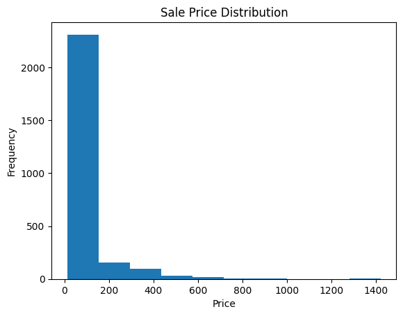
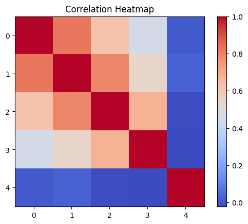
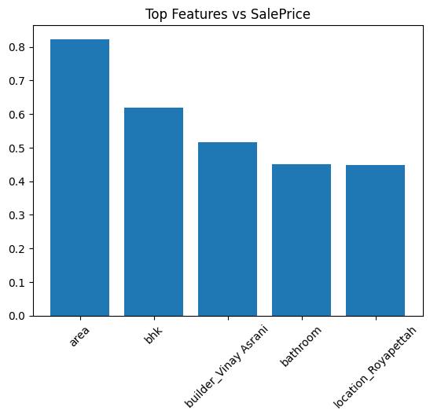
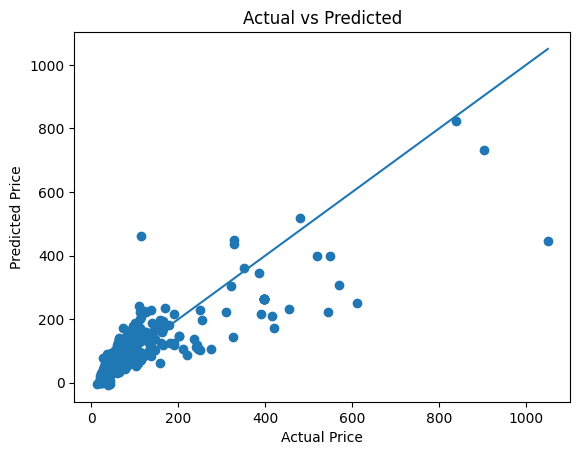
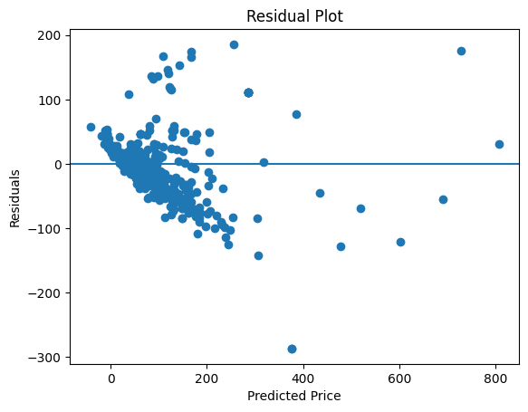
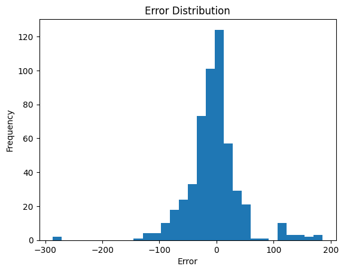

# 🏠 Housing Price Prediction using Regression

> **Course:** Deep Learning (BEEE422L) | **Library:** scikit-learn

---

## 📌 Problem Statement

Predicting real estate prices is a high-impact regression problem with direct applications in finance and urban planning. This project builds a **regression model** to estimate house prices based on a set of structural, locational, and demographic features. The workflow covers exploratory data analysis (EDA), feature engineering, model training, and thorough evaluation.

---

## 📂 Dataset Description

The dataset contains records of residential house sales, including:

| Feature Category | Examples |
|---|---|
| **Structural** | Number of bedrooms, bathrooms, floors, square footage |
| **Locational** | Zipcode, latitude, longitude, waterfront view |
| **Condition** | House condition rating, grade, year built, year renovated |
| **Target Variable** | `price` — sale price of the house (USD) |

> **Note:** The dataset is provided externally and must be placed in the `dataset/` folder before running the notebook.

---

## 🔍 Exploratory Data Analysis (EDA)

### Price Distribution

> The distribution of house prices is **right-skewed**, with a long tail towards higher values. This indicates that a majority of houses are priced in a moderate range, while a small fraction are significantly more expensive luxury properties. A log transformation on the target variable was considered to normalize this distribution.

---

### Correlation Heatmap

> The correlation heatmap shows relationships between numerical features in the dataset. Some features exhibit strong positive correlations, while others show weak or negative relationships. This helps in understanding feature dependencies and identifying multicollinearity.

---

## 🤖 Model

**Linear Regression** (`sklearn.linear_model.LinearRegression`)

Features were pre-processed with standard scaling and irrelevant identifiers (e.g., `id`) were dropped prior to training. An 80/20 train-test split was used.

---

## 📊 Evaluation Metrics

| Metric | Description |
|---|---|
| **MAE** | Mean Absolute Error — average magnitude of prediction errors |
| **MSE** | Mean Squared Error — penalizes larger errors more heavily |
| **R² Score** | Proportion of variance in price explained by the model |

> Refer to the notebook for exact numerical values computed on the test set.

---

## 📈 Visualizations

### Feature Importance

> Displays the magnitude of regression coefficients (or feature importances), highlighting which attributes most strongly drive predicted price. `area` and `bhk` consistently rank among the top predictors.

---

### Actual vs. Predicted

> A scatter plot of actual prices against model predictions. Ideal predictions lie on the diagonal (y = x). Deviations above or below the diagonal indicate over- and under-predictions, respectively. The model performs well for mid-range prices, with increasing scatter at higher price points.

---

### Residual Plot

> Residuals (errors) are plotted against predicted values. Residuals are broadly **centered around zero**, suggesting the model is unbiased on average. However, a **funnel-shaped spread** (heteroscedasticity) is visible at higher predicted prices, meaning the model's uncertainty grows as prices increase — a common limitation of linear regression on skewed targets.

---

### Error Distribution

> The distribution of residuals is approximately **bell-shaped and centered near zero**, which is consistent with the assumptions of linear regression. A slight right skew is attributable to the luxury property outliers in the dataset.

---

## 🔍 Analysis

### Residuals Centered Around Zero
The mean residual being close to zero confirms that the model does not have systematic directional bias — it is neither consistently over- nor under-predicting house prices across the test set.

### Heteroscedasticity
The funnel pattern in the residual plot indicates that prediction errors are larger for expensive homes. This heteroscedasticity violates one of linear regression's key assumptions and suggests that:
- A **log transformation** of the target variable may improve performance.
- **Non-linear models** such as Gradient Boosting (XGBoost / LightGBM) or Random Forest would better capture the complex interactions at the higher end of the price distribution.

### Error Distribution Near Normal
Despite the heteroscedasticity, the overall error distribution approximates a normal curve, validating that the model's statistical assumptions are broadly satisfied for the bulk of the data.

---

## ✅ Conclusion

The Linear Regression model provides a solid interpretable baseline for house price prediction. It captures the majority of price variance through key structural and locational features. Future improvements could include applying log-price transformation, engineering interaction features, and exploring ensemble tree-based models to better handle non-linearity and heteroscedasticity.

---

*← [Back to Main Repository](../README.md)*
