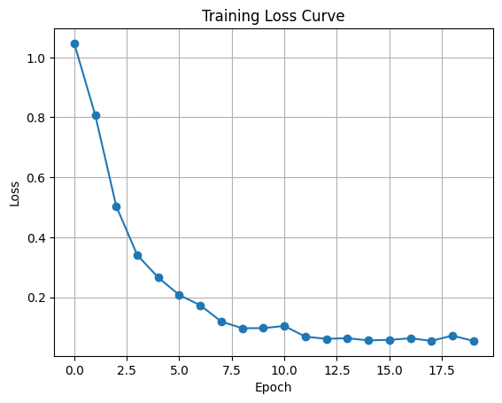
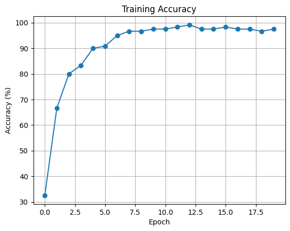
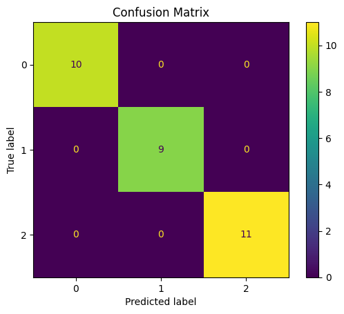

# 🌸 Iris Flower Classification using MLP

> **Course:** Deep Learning (BEEE422L) | **Framework:** PyTorch

---

## 📌 Problem Statement

The Iris dataset is a classic benchmark in machine learning. The objective of this project is to train a **Multi-Layer Perceptron (MLP)** using PyTorch to classify iris flowers into one of three species — *Setosa*, *Versicolor*, and *Virginica* — based on four morphological measurements.

---

## 📂 Dataset Description

| Property | Details |
|---|---|
| **Dataset** | Iris (Fisher's Iris Dataset) |
| **Features** | 4 — Sepal Length, Sepal Width, Petal Length, Petal Width |
| **Classes** | 3 — *Iris-Setosa*, *Iris-Versicolor*, *Iris-Virginica* |
| **Total Samples** | 150 (50 per class) |
| **Source** | `sklearn.datasets.load_iris` |

The dataset is linearly separable for *Setosa* vs. the other two classes, while *Versicolor* and *Virginica* have slight overlap, making it an ideal benchmark for evaluating classifier boundaries.

---

## 🏗️ Model Architecture

A fully-connected **Multi-Layer Perceptron (MLP)** with the following structure:

```
Input Layer:      4 neurons   (one per feature)
Hidden Layer 1:   16 neurons  + ReLU activation
Hidden Layer 2:    8 neurons  + ReLU activation
Output Layer:      3 neurons  (one per class)
```

**Total Parameters:** ~219

---

## ⚙️ Training Details

| Hyperparameter | Value |
|---|---|
| **Epochs** | 20 |
| **Optimizer** | Adam |
| **Learning Rate** | 1e-3 |
| **Loss Function** | CrossEntropyLoss |
| **Train / Test Split** | 80% / 20% |

---

## 📈 Results

| Metric | Value |
|---|---|
| **Test Accuracy** | **100%** |

---

## 📊 Visualizations

### Training Loss



> The loss curve drops steeply within the first 10–12 epochs and flattens out, indicating rapid and stable convergence on this small, well-structured dataset.

---

### Training Accuracy



> Accuracy reaches 100% around epochs 10–12 and remains constant thereafter, demonstrating that the model has fully captured the decision boundaries of all three classes.

---

### Confusion Matrix



> A perfectly diagonal confusion matrix with no off-diagonal entries, confirming that all 30 test samples (20% of 150) were classified correctly.

---

## 🔍 Analysis

### Early Convergence (~10–12 Epochs)
The model converges very quickly relative to the number of epochs, which is characteristic of small, low-dimensional datasets. With only 4 input features and 150 samples, the network requires minimal iterations to find an effective decision boundary.

### Why 100% Accuracy is Expected
The Iris dataset is exceptionally well-structured:
- *Setosa* is linearly separable from the other two classes.
- *Versicolor* and *Virginica*, while overlapping in raw feature space, become well-separable with even a shallow non-linear transformation.

Given these properties, a small MLP is more than sufficient to achieve perfect classification on a standard train/test split.

### Dataset Simplicity & Generalization Caveat
While 100% accuracy is a strong result, the dataset's small size (150 samples) and simplicity mean that this result should not be over-interpreted. Real-world datasets with higher dimensionality, noise, and class imbalance would require more robust regularization and architectural choices.

---

## ✅ Conclusion

The MLP achieves **100% classification accuracy** on the Iris test set within just 20 training epochs. This project illustrates how even a lightweight neural network can perfectly solve well-structured classification problems, and sets the stage for tackling more complex datasets.

---

*← [Back to Main Repository](../README.md)*
