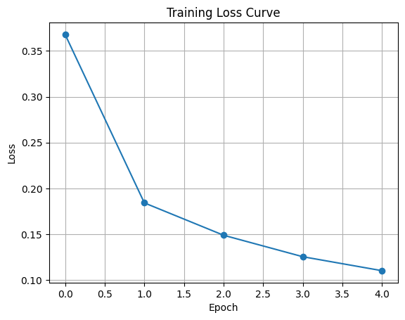
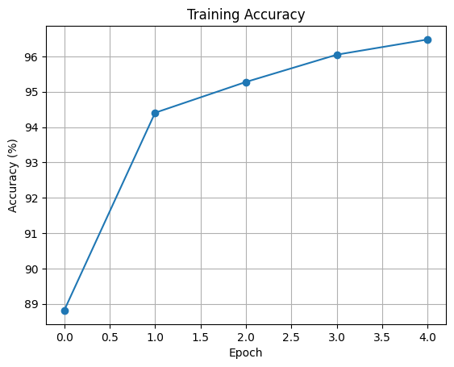
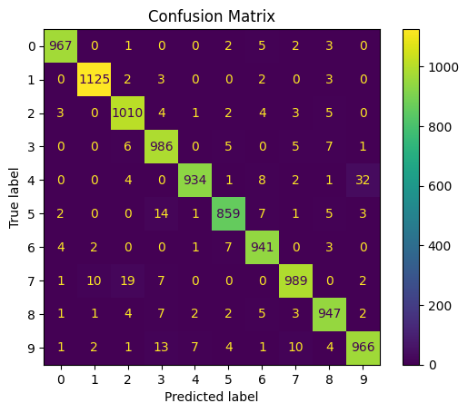

# 🔢 MNIST Digit Classification using MLP

> **Course:** Deep Learning (BEEE422L) | **Framework:** PyTorch

---

## 📌 Problem Statement

Handwritten digit recognition is a foundational computer vision problem. The goal of this project is to build and train a **Multi-Layer Perceptron (MLP)** on the MNIST dataset to correctly classify grayscale images of handwritten digits (0–9) with high accuracy.

---

## 📂 Dataset Description

| Property | Details |
|---|---|
| **Dataset** | MNIST (Modified National Institute of Standards and Technology) |
| **Image Size** | 28 × 28 pixels (grayscale) |
| **Classes** | 10 (digits 0–9) |
| **Training Samples** | 60,000 |
| **Test Samples** | 10,000 |
| **Source** | `torchvision.datasets.MNIST` (auto-downloaded) or the [official MNIST database](http://yann.lecun.com/exdb/mnist/) |

> **Note:** The MNIST dataset is **not bundled in this repository** due to its large size. When you run the notebook, `torchvision` will automatically download it to a local cache directory. Alternatively, you can download it directly from the [MNIST database](http://yann.lecun.com/exdb/mnist/) or any common ML dataset mirror (e.g., Kaggle, HuggingFace Datasets).

Each image is flattened to a 784-dimensional vector before being fed into the MLP.

---

## 🏗️ Model Architecture

A fully-connected **Multi-Layer Perceptron (MLP)** with the following structure:

```
Input Layer:      784 neurons  (28×28 flattened)
Hidden Layer 1:   128 neurons  + ReLU activation
Hidden Layer 2:    64 neurons  + ReLU activation
Output Layer:      10 neurons  (one per class)
```

**Total Parameters:** ~109,386

---

## ⚙️ Training Details

| Hyperparameter | Value |
|---|---|
| **Epochs** | 5 |
| **Optimizer** | Adam |
| **Learning Rate** | 1e-3 |
| **Loss Function** | CrossEntropyLoss |
| **Batch Size** | 64 |

---

## 📈 Results

| Metric | Value |
|---|---|
| **Test Accuracy** | ~97% |

---

## 📊 Visualizations

### Training Loss



> The training loss decreases steadily across epochs, indicating stable convergence and effective gradient updates via the Adam optimizer.

---

### Training Accuracy



> Accuracy rises sharply within the first couple of epochs and plateaus near 97–98%, confirming that the model generalizes well to unseen digit images.

---

### Confusion Matrix



> The matrix reveals strong diagonal dominance, meaning most digits are correctly classified. Minor off-diagonal entries typically occur between visually similar digits (e.g., 4 vs 9, 3 vs 8).

---

## 🔍 Analysis

### Loss Convergence
The training loss drops significantly after the first epoch and continues to decrease at a progressively slower rate. This behavior is expected with Adam optimization, which adapts the learning rate per parameter, allowing rapid initial convergence followed by fine-grained refinement.

### Why MLP Works Well Here
MNIST digits, while high-dimensional, are relatively simple and well-structured. An MLP with two hidden layers has sufficient representational capacity to capture the discriminative features per digit class.

### Limitations & Improvements
- **Flattening** the 28×28 image destroys spatial relationships — a **Convolutional Neural Network (CNN)** would leverage local spatial structure more effectively and likely push accuracy above 99%.
- Adding **dropout** or **batch normalization** could further improve generalization and reduce overfitting risk.

---

## ✅ Conclusion

The MLP achieves approximately **97% accuracy** on the MNIST test set, demonstrating that even a simple feedforward network can effectively classify handwritten digits. This project establishes a solid baseline before exploring more sophisticated architectures like CNNs.

---

*← [Back to Main Repository](../README.md)*
